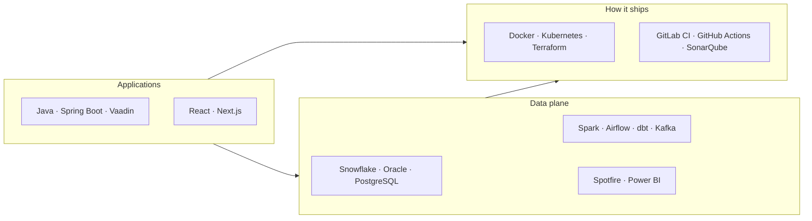

<div align="center">


<br/>

[](https://www.linkedin.com/in/smarakmishra1827/)
[](mailto:smarakmishra18@gmail.com)
[](https://github.com/Foxyy-SM)

<br/>

[](https://www.linkedin.com/in/smarakmishra1827/)


</div>

---

## About

Software Development Engineer at **IQVIA India, Bengaluru**. I work on a Java clinical-analytics platform used by about **25k** people, and on the data path underneath it: **15+** TIBCO Spotfire reports moved to Snowflake, **20+** Oracle and Snowflake queries tuned, and the defects that were making regulatory reporting unsafe to trust.

The same habits show up in the portfolio. PayNexus is an event-driven payment platform. The subscription analytics project is a warehouse, two BI front ends, and a job that refuses to publish a bad mart. I like owning a slice from the query plan through the pipeline that ships it.

```yaml
name: Smarak Mishra
role: Software Development Engineer I
company: IQVIA India, Bengaluru
since: Feb 2024 (intern) → Sep 2024 (SDE-1)
education: B.E. Electronics & Communication Engineering — Dayananda Sagar College of Engineering
focus:
  - Java / Vaadin clinical analytics: 5 data sources, 7 workflow families
  - Spotfire → Snowflake migration and SQL performance
  - CI that actually gates a release (GitLab, SonarQube, GitHub Actions)
currently_exploring:
  - LLMs, RAG, and agent-style backends
  - Terraform, Kubernetes, and pipeline-as-code
```

<div align="center">


</div>

---

## Tech stack

<div align="center">


</div>

<details open>
<summary><b>Languages</b></summary>
<br/>


</details>

<details>
<summary><b>Backend, frameworks & libraries</b></summary>
<br/>


</details>

<details>
<summary><b>Data, warehouses & BI</b></summary>
<br/>


</details>

<details>
<summary><b>Cloud, DevOps & delivery</b></summary>
<br/>


</details>



---

## What I've shipped

<table>
<tr>
<td width="50%" valign="top">

### [PayNexus](https://github.com/Foxyy-SM/PayNexus-Event-Driven-Microservices-Payment-Platform-with-Fraud-Detection-and-Analytics)

Six-service payment platform. Idempotency keys and optimistic locking stop duplicate charges. A Resilience4j circuit breaker (50% failures over a 10-call window) keeps checkout alive when the fraud service is down. Terraform on AWS (EKS, RDS, ElastiCache, ECR), HPA from 2 to 6 replicas at 70% CPU, plus a FastAPI warehouse that feeds Power BI.

`Java 21` `Spring Boot 3` `Kafka` `PostgreSQL` `Redis` `React` `Kubernetes` `Terraform`

<a href="https://github.com/Foxyy-SM/PayNexus-Event-Driven-Microservices-Payment-Platform-with-Fraud-Detection-and-Analytics"></a>

</td>
<td width="50%" valign="top">

### [Subscription analytics](https://github.com/Foxyy-SM/End-to-End-Subscription-Analytics-Revenue-Intelligence-Platform)

End-to-end revenue intelligence for a YouTube Premium-style business. Synthetic subscribers land in a dimensional warehouse. SQL marts own logo and revenue retention, GRR/NRR, churn hazard, trial-to-paid, and discounted LTV. Power BI and Spotfire only present those marts. pytest blocks the weekly Slack report when the marts fail.

`Python` `SQL` `SQLite` `Snowflake` `Power BI` `DAX` `Spotfire` `GitHub Actions`

<a href="https://github.com/Foxyy-SM/End-to-End-Subscription-Analytics-Revenue-Intelligence-Platform"></a>

</td>
</tr>
<tr>
<td width="50%" valign="top">

### [Airbnb ETL](https://github.com/Foxyy-SM/Airbnb-Dataset-ETL-Pipeline)

FastAPI ETL over seven Airbnb datasets. Async downloads with aiohttp cut processing time by **60%**. Schemas for Azure SQL, PostgreSQL, and MySQL, a REST API with 7+ endpoints, multi-stage Docker images about **40%** smaller, and GitHub Actions for deploy.

`Python` `FastAPI` `Azure Blob` `Docker` `PostgreSQL` `MySQL`

<a href="https://github.com/Foxyy-SM/Airbnb-Dataset-ETL-Pipeline"></a>

</td>
<td width="50%" valign="top">

### [Zomato EDA](https://github.com/Foxyy-SM/Exploratory-Data-Analysis-on-Zomato)

Exploratory analysis on **50,000+** restaurant records. Six findings on cuisine versus rating, price-band demand, and city density, drawn with heatmaps, pivot tables, and box plots. Presented at the YEAH national hackathon.

`Python` `Pandas` `Seaborn` `Matplotlib` `Jupyter`

<a href="https://github.com/Foxyy-SM/Exploratory-Data-Analysis-on-Zomato"></a>

</td>
</tr>
<tr>
<td width="50%" valign="top">

### CA-webapp

Java web app that ingests client clinical data, audits it for leadership, and estimates drug efficiency from clinical parameters.

`Spring Boot` `Maven` `Hibernate` `JWT`

</td>
<td width="50%" valign="top">

### BlogEz

Full-stack blog with dark mode, category featured posts, and Google social login.

`Next.js` `MongoDB`

</td>
</tr>
<tr>
<td colspan="2" valign="top">

### Student result tracking CRM

Result management for a college: live reports and dashboards for students and staff.

`Salesforce` `Apex` `Visualforce`

</td>
</tr>
</table>

---

## Impact

| | Metric | Result |
|---|---|---|
| 🏥 | Clinical analytics platform | **~25k** users, **5** data sources, **7** workflow families |
| ⚡ | Dashboard execution | **5** isolated pools, **50** workers, refresh cancel + **90–120s** timeouts |
| 🔐 | Access | Ping SSO and AD role checks across **2** domains, secrets in Key Vault |
| 🚢 | Delivery | **8-stage** GitLab pipeline, deploys to **9** environments |
| 🧪 | SonarQube coverage | **95.2%** after an in-pipeline Java unit-test generator |
| 🚀 | Spotfire → Snowflake | **15+** reports, query time **↓ 25%**, load time **↓ 30%** |
| 🔍 | Query & data quality | **20+** queries tuned, **10+** accuracy defects cleared, audit-ready reporting |
| 🤝 | Internship | **1 of 18**, chosen from ~**200** applicants |

---

## Experience

```text
2024 ━━━━━━━━━━━━━━━━━━━━━━━━━━━━━━━━━━━━━━━━━━━━━━━━ now
        SDE-1, Data & Analytics          IQVIA, Bengaluru
        Java/Vaadin platform · Snowflake migration · GitLab CI

2024 ━━━━━━━━━━━━━━━━━ Feb → Aug
        Software Development Intern      IQVIA, Bengaluru
        Snowflake, Oracle SQL, Azure, Python, SDLC on live migration work

2020 ━━━━━━━━━━━━━━━━━━━━━━━━━━━━━━━━━━ ECE
        B.E. Electronics & Communication
        Dayananda Sagar College of Engineering, Bengaluru
```

**At IQVIA I spend the week on three kinds of work**

1. **Product backend.** Server-side Java/Vaadin that unifies Oracle, Snowflake, and service APIs into dashboards, drill-downs, and clinical-operations workflows.
2. **Data migration.** Spotfire reports rebuilt on Snowflake with stakeholders in the room, so the number on the new report matches the number compliance already signed.
3. **The path to production.** Unit tests, Sonar, secret scan, WAR build, Nexus publish, then a controlled push across environments.

---

## GitHub

<div align="center">


<br/>


<br/>


<br/>


</div>

---

## Credentials & community

| | |
|---|---|
| ☁️ | **30 Days of Google Cloud** — Cloud Engineering and Data Science/ML tracks, 2023 · [write-up](https://www.linkedin.com/feed/update/urn:li:activity:6858950010265051136/) |
| 🧠 | **Google AI Essentials**, 2026 · [Coursera](https://www.coursera.org/account/accomplishments/specialization/TUWEZ1DRQ48B) |
| 🎓 | **AWS Machine Learning Foundations** — AWS × Udacity |
| 🌐 | **Google Developer Student Clubs** — GCP, Docker, Go, microservices, mutexes, threads, goroutines |
| ⭐ | **HackerRank** — 5★ in C++, Java, and Python |
| 🏅 | **YEAH National Hackathon** (Devfolio) — Zomato EDA |

---

## Now

```text
LLMs, RAG, agent backends     [■■■■■■■■□□]  digging in
Terraform & CI/CD             [■■■■■■■□□□]  shipping with it
Snowflake, SQL, Power BI      [■■■■■■■■■□]  daily at work
Spring Boot & services        [■■■■■■■■□□]  daily at work
```

---

<div align="center">

### Let's talk

If you are hiring for backend or data engineering, or you want a walkthrough of PayNexus or the subscription warehouse, write me.

[](https://www.linkedin.com/in/smarakmishra1827/)
[](mailto:smarakmishra18@gmail.com)
[](https://github.com/Foxyy-SM)

<br/>


</div>
